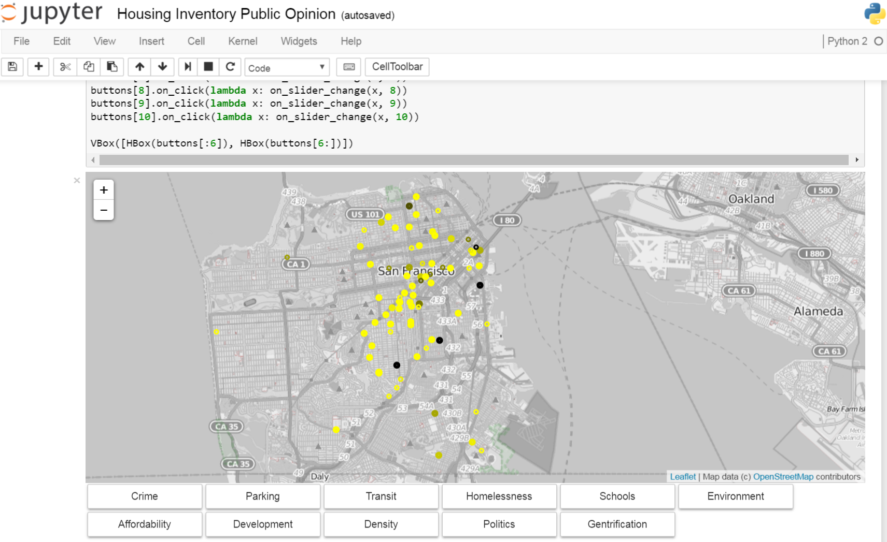

#How can **data** help communities thrive?
### Department of Housing and Urban Development
Presented by What Works Cities and Bloombergs
Made with love by: Xiaomin Wei, Joey Hu, Armin Burgmeier, Luke Babich and Nick Madrid.

# What we hope to solve
Housing inequality is present in cities across the United States, rendering low income families unable to obtain affordable housing. Lack of fair housing opportunities is just one of the problems communities face: many people also lack access to transportation and services within the community.

Help cities enhance their use of data and evidence to uncover new ways to revitalize neighborhoods and improve the lives of residents.

# Data used
The Housing Inventory is the Planning Department's annual survey of housing production trends in San Francisco. It has reported changes in the City's housing stock, including housing construction, demolition, and alterations, since 1967. 

The Housing Inventory also reports the annual net gain in housing units citywide by general Zoning Districts and by Planning Districts. Net gain is the number of newly constructed units with CFCs issued, adjusted for alterations - which can add or subtract units - and demolitions. Affordable housing, condominiums, and changes in the residential hotel stock are other areas of interest covered by the Housing Inventory. 

| Address            | Units | Net Units | Affordable Housing | Affordable Target|
| ------------------ |:-----:|:---------:|:------------------:|------------------|
| 1407 Market Street | 317   | 317       | 38                 | LI - Low Income  |

- [2014 Housing Inventory](https://data.sfgov.org/Housing-and-Buildings/2014-Housing-Inventory/pucn-j93j)
- [2013 Housing Inventory](https://data.sfgov.org/Housing-and-Buildings/2013-Housing-Inventory/e7d3-dxh5)
- [2012 Housing Inventory](https://data.sfgov.org/Housing-and-Buildings/2012-Housing-Inventory/4xa2-t52k)
- [2011 Housing Inventory](https://data.sfgov.org/Housing-and-Buildings/2011-Housing-Inventory/mpcm-79w2)
- [Zillow API](http://www.zillow.com/howto/api/APIOverview.htm)
- [San Francisco Property Information Map](http://propertymap.sfplanning.org/)

# What we actually solved and interesting things learned

- We took the address provided in the Housing Inventory data sets and used the Google Map API to gather associated lattitude and longitude for each value. 
- We then leveraged the recently open sourced [Jupyter Notebook widget for leaflet maps](https://github.com/ellisonbg/ipyleaflet) to plot the net change in units for a given address. 

- `Green` = units were added. `Dark Green` = larger number of units added.
- `Red` = units were removed. `Dark Red` = larger number of units removed.

- The data show an increase in construction activity in each year from 2011 to 2014

- We then took that same data for a given year (buildings where units were added/removed) and searched Zillow for current rents. Data was normalzied by price per square foot.

- `Bright Red` = units that are the most expensive (on a price per square foot basis)
- `Black` = units that are the least expensive

- We continued our analysis by using the same addresses found in the Housing Inventory data and cross referencing them with [SocketSite](http://www.socketsite.com/) is a popular site for people to read and talk about the San Francisco Real Estate market.
- We scrapped SocketSite searching for the address name in the article title or within the body.
- When a positive match was found we captured the comments section.
- Comments were used to perform both topic and sentiment analysis.
- You are able to see which properties are associated with specifc topic areas. Furthermore, the color indicates how often a given topic was talked about for a given bulding. This data does not allow you to compare one bulding to another (e.g., parking was more important to one building over another).
- The data below highlights the `parking` topic area for buildings found in the Housing Inventory from 2011-2014 that also had an article(s) on SocketSite.

- It's important to know that any building built before June 13, 1979 is required to adhere to [San Francisco's rent control laws](https://www.sftu.org/rentcontrol).
- Significant work was done to gather buliding information such as year built and assessed value from the [San Francisco Property Information Map](http://propertymap.sfplanning.org/).
- We took a random sampling of San Francicos's 200,000+ buildings and plotted over 1,700 buildings with color indicating the year they were built. While not comprehensive, it is a representative sample.

- `Dark Green` = older building

# Challenges faced

 - Most recent hosing inventory was as of 2014
 - Many state and local governments do a great job at providing data visualizations. Challenges arise when that data cannot be easily [consumed by a machine](http://egis.hud.gov/affht/). 

# Areas to take this further

- Overlay [Petitions to Rent Board](https://data.sfgov.org/Housing-and-Buildings/Petitions-to-the-Rent-Board/6swy-cmkq) to see if there are specific areas of San Francisco receiving a larger number of reports (either from tenants or landlords)

- Explore any correlation between [Airbnb listings](http://all-about-airbnb.com/post/127856658166/airbnb-public-api-coming-soon) and [changes in inflation/rents](http://www.bls.gov/eag/eag.ca_sanfrancisco_msa.htm)  as well as [eviction notices](https://data.sfgov.org/Housing-and-Buildings/Eviction-Notices/5cei-gny5). 
